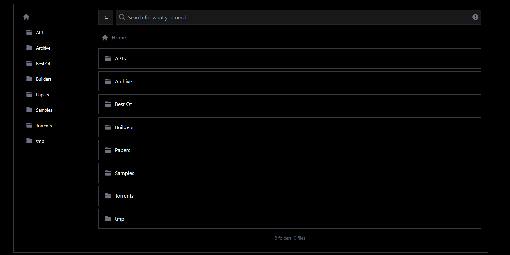
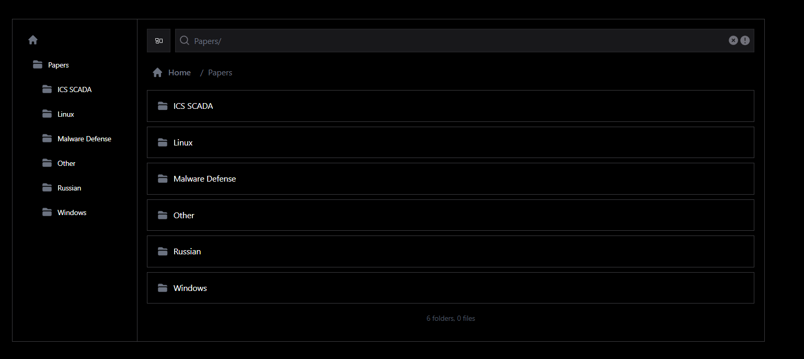
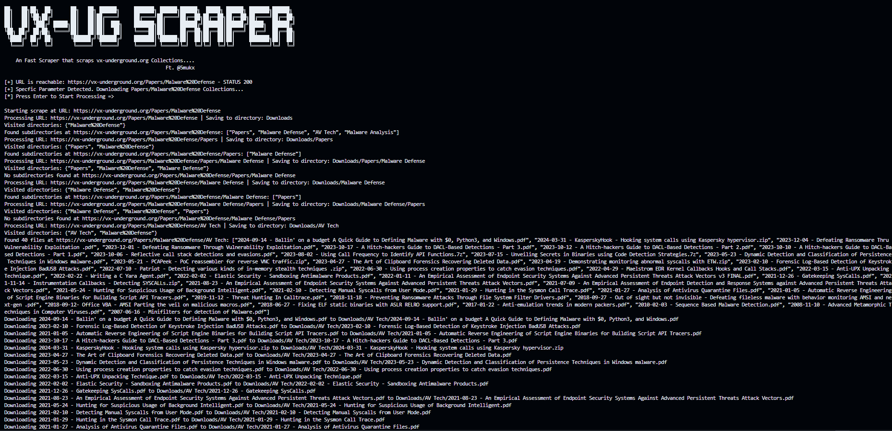

<div align="center">

  <h3><a href="https://github.com/Whitecat18/vxug-scraper">VX-UNDERGROUND SCRAPER</a></h3>
  
  <br><br>
  <p>A fast and efficient web scraper designed to download collections from <a href= "https://vx-underground.org" > vx-underground.org</a></p>
  <p>By <a href="https://x.com/5mukx">@5mukx</a></p>

  
  
  
  
  
</div>

-------
<br>

This tool recursively crawls, identifies downloadable files (.pdf, .zip, .7z), and saves them to a Download file.

### Features:-

Recursive Scraping: Automatically crawls subdirectories on vx-underground.org to find and download files.

* File Type Support: Downloads .pdf, .zip, and .7z files.
* Customizable Starting Point: Optionally specify a subdirectory to scrape a specific collection.
* Robust Error Handling: Retries failed downloads up to three times and skips invalid links.
* Organized Storage: Saves files in a directory structure mirroring the website's hierarchy.
* Visited URL Tracking: Prevents redundant scraping of already processed directories.
* User-Friendly Interface: Displays a banner and progress updates during scraping.
* Concurrency Control: Limit the number of simultaneous downloads per directory (`-c`, `--concurrency`).
* aria2c Integration: Optionally use `aria2c` for downloads (`-a`, `--aria`) and pass extra arguments with `--aria-opts`.
* Pre-resume Paused Downloads: When aria2c is enabled (`-a`), the scraper scans for existing `.aria2` control files in the output directory and resumes those downloads before scraping proceeds.

### Prerequisites

Rust: Ensure you have Rust installed. You can install it via rustup.


### Installation

Clone or download the repository containing the code.

Navigate to the project directory:

```bash
cd vxug-scraper
```

Build the project:

```bash
cargo build --release
```

To run the project: 

```bash
cargo run --release
```

### USAGE:

 > ⚠️ Use Tool with Caution. You may get banned temporary if you misuse this tool !

 Show help at any time with `-h` or `--help`.
 When aria2c is enabled (`-a`), the scraper will first resume any incomplete downloads by scanning for `.aria2` control files in the output directory.
 
 You can optionally specify an output directory with `-o` or `--output-dir`. If not provided, defaults to `Downloads`.
 
 Example: Download the "Papers" collection to a custom directory:
 
```bash
cargo run --release -- -o /path/to/output Papers
```

You can also limit the time between requests using `-r` or `--rate-limit`. For example, wait 5 seconds between each HTTP call:

```bash
cargo run --release -- -r 5
```
Limit the number of concurrent downloads per directory using `-c` or `--concurrency`. For example, allow up to 5 simultaneous downloads:

```bash
cargo run --release -- -c 5
```

By default, the scraper uses its internal HTTP downloader. To enable `aria2c` for downloads, add the `-a` or `--aria` flag:

```bash
cargo run --release -- -a Papers
```
By default, when using `aria2c`, the scraper applies `-x 4 -s 4` for multi-connection downloads. To override or customize, use `--aria-opts`.

You can pass extra options to `aria2c` with `--aria-opts`. For example:

```bash
cargo run --release -- -a --aria-opts "-x 10 -s 2" Papers
```
Use `--aria-threshold` to only invoke aria2c for files larger than a given size (in bytes). For example, to limit aria2c to files over 100 MB (104857600 bytes):

```bash
cargo run --release -- -a --aria-threshold 104857600 Papers
```

Note: Some servers may not support segmented range requests, leading to "Invalid range header" errors. If you encounter these, omit `-a`, or adjust `--aria-opts` (e.g., reduce connections or remove split downloads).

Or combine with output-dir and collection:

```bash
cargo run --release -- -r 5 -o /path/to/output Papers
```


To scrape all the collections. 

```bash
cargo run --release
```

To download a particular collection !

```bash
cargo run -- <Directory of Page>
```

Example: 



I'm choosing to download Papers so 

```bash
cargo run --release -- Papers
```

or if you want to download specfic directories for example: I need to download Windows Papers from Paper collections.



```bash 
cargo run --release -- Papers/Windows
```

If the path is contains space. Add %20 instead of space..

```bash
cargo run --release -- Papers/Malware%20Defense
```

### Sample Output



Used: `cargo run --release -- Papers/Malware%20Defense`


-----

Contributors are welcome =) 

Check out my other works here: [Rust for Malware development Repository](https://github.com/Whitecat18/Rust-for-Malware-Development.git) 
